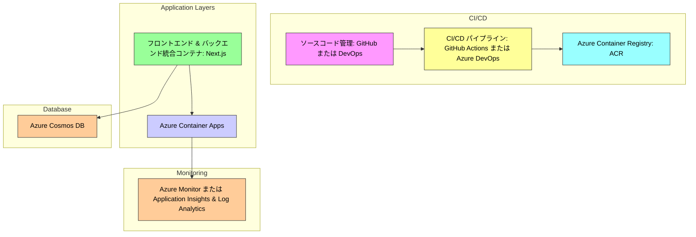
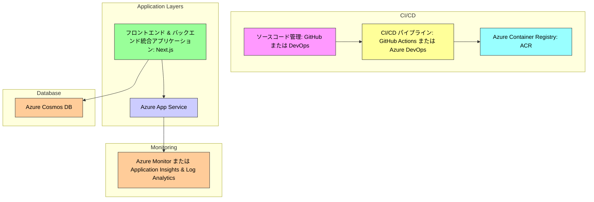

# Azure におけるコンテナアプリケーション開発 (DevOps & AIOps)

## 概要

本講座では、Azure を活用したコンテナアプリケーション開発の実践を通じて、以下のスキルを習得します：
- Next.js を用いたフロントエンドとバックエンドの統合開発
- コンテナ化アプリケーションのビルド、デプロイ、運用
- CI/CD パイプライン構築による自動化
- サーバーレスアーキテクチャの理解と実践
- 監視基盤の構築と AIOps を活用した運用改善

---

## アーキテクチャ構成

### 1. 論理的なアーキテクチャ

#### フロントエンド & バックエンド層
- **技術スタック**: Next.js
- **デプロイ先**: Azure Container Apps
- **特徴**: 統合設計で開発・運用効率を向上

#### データ層
- **技術スタック**: Azure Cosmos DB
- **特徴**: グローバル分散、スケーラブルなデータストレージ

#### CI/CD 層
- **技術スタック**: GitHub Actions または Azure DevOps
- **特徴**: 自動化による効率的なデプロイ

---

### 2. アーキテクチャの実践

#### コンテナのビルド＆デプロイ
- Dockerfile 作成、Azure Container Registry (ACR) へのプッシュ
- CI/CD パイプラインでの自動化

#### Azure コンテナサービス の活用
- オートスケーリング、リビジョン管理を活用した運用

---

## アーキテクチャ例

### Azure Container Apps を用いた構成

### Azure App Service を用いた構成

---

## サンプルアプリケーション「TODO アプリ」

### 概要
- **フロントエンド & バックエンド**: Next.js を使用した統合アプリケーション
- **データベース**: Azure Cosmos DB を利用

### 特徴
- サーバーレス運用で迅速なデプロイと管理負担の軽減
- CI/CD による効率的なデプロイと運用改善

---

## 実践編の流れ

1. **初期セットアップ**
   - サンプルアプリのクローン、Dockerfile 作成、ACR 設定
2. **CI/CD パイプライン構築**
   - GitHub Actions または Azure DevOps を活用
3. **運用と改善**
   - オートスケール、ローリングアップデートの実践
   - 監視基盤の構築と運用改善

---

## まとめ

本講座を通じて、Azure 上でのコンテナアプリケーション開発に必要な中級スキルを習得し、実運用に直結する知識を身につけます。