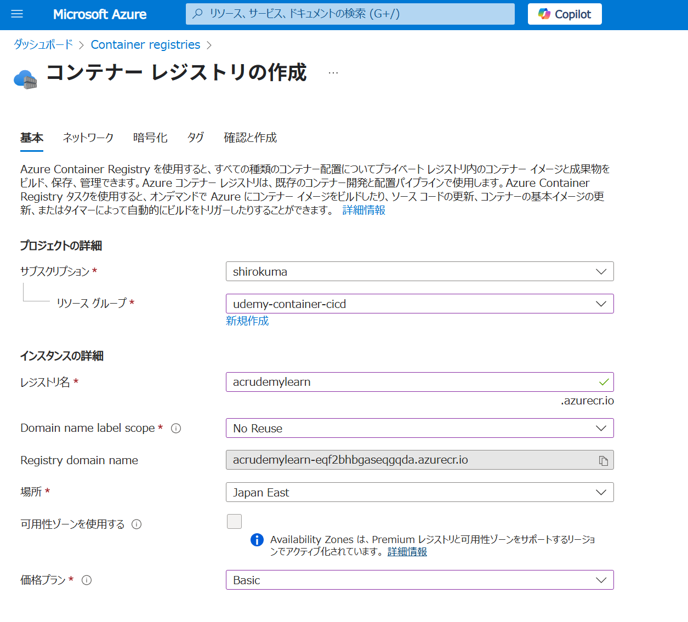
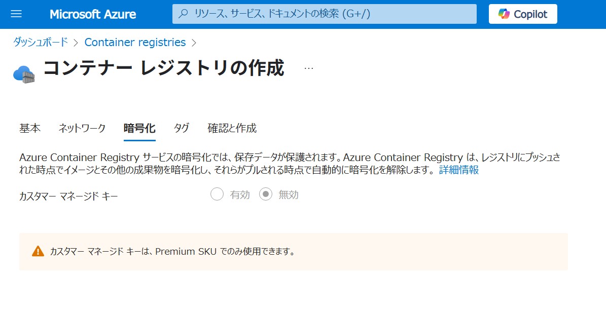
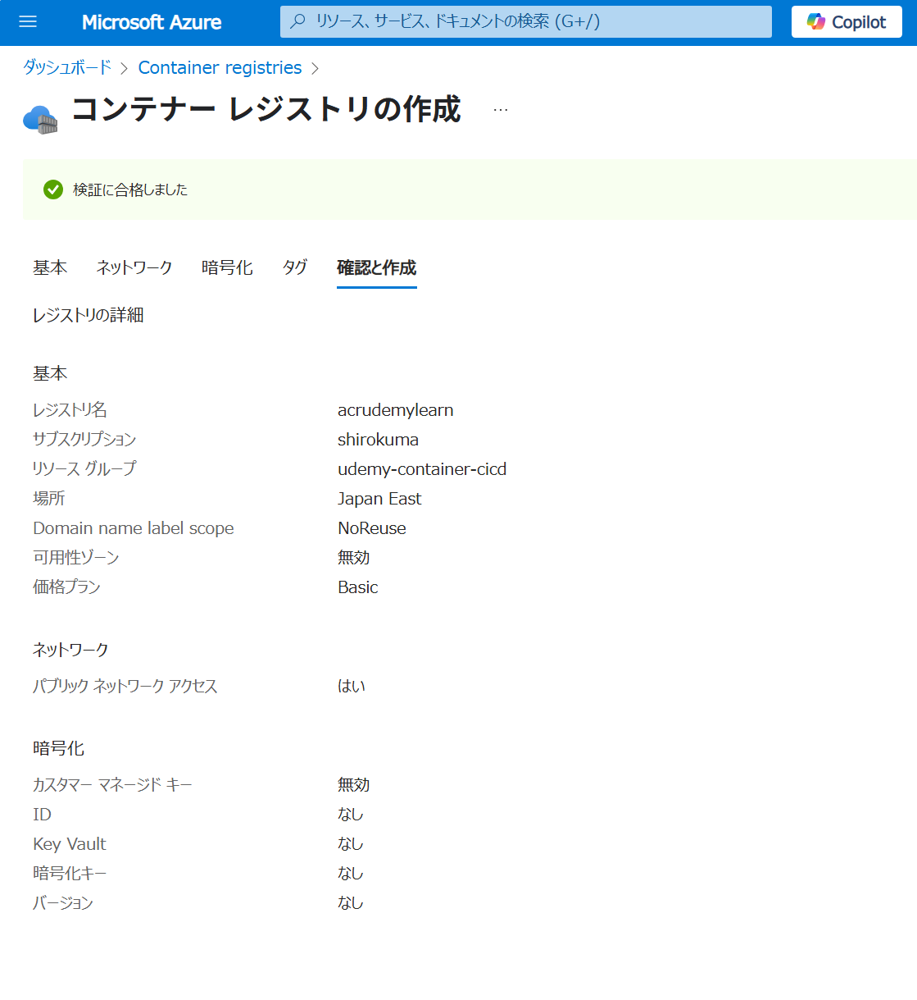
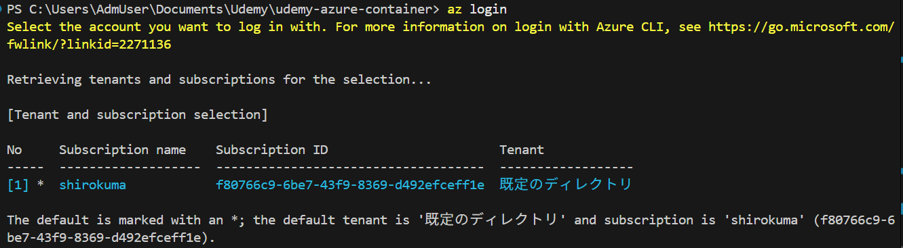
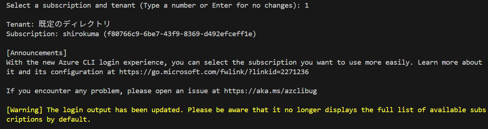
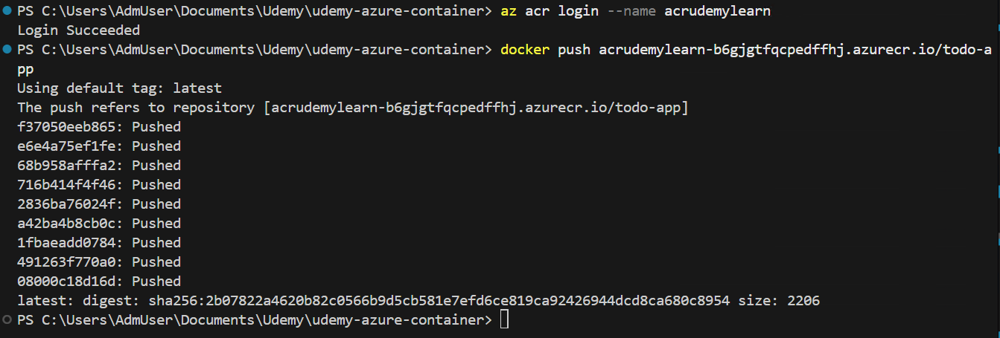

# リソース作成








# (手動)コンテナのPush

```bash
docker-compose build
docker tag todo-app acrudemylearn-b6gjgtfqcpedffhj.azurecr.io/todo-app
```

```bash
az login
az acr login --name acrudemylearn
docker push acrudemylearn-b6gjgtfqcpedffhj.azurecr.io/todo-app
```





