# リソース作成
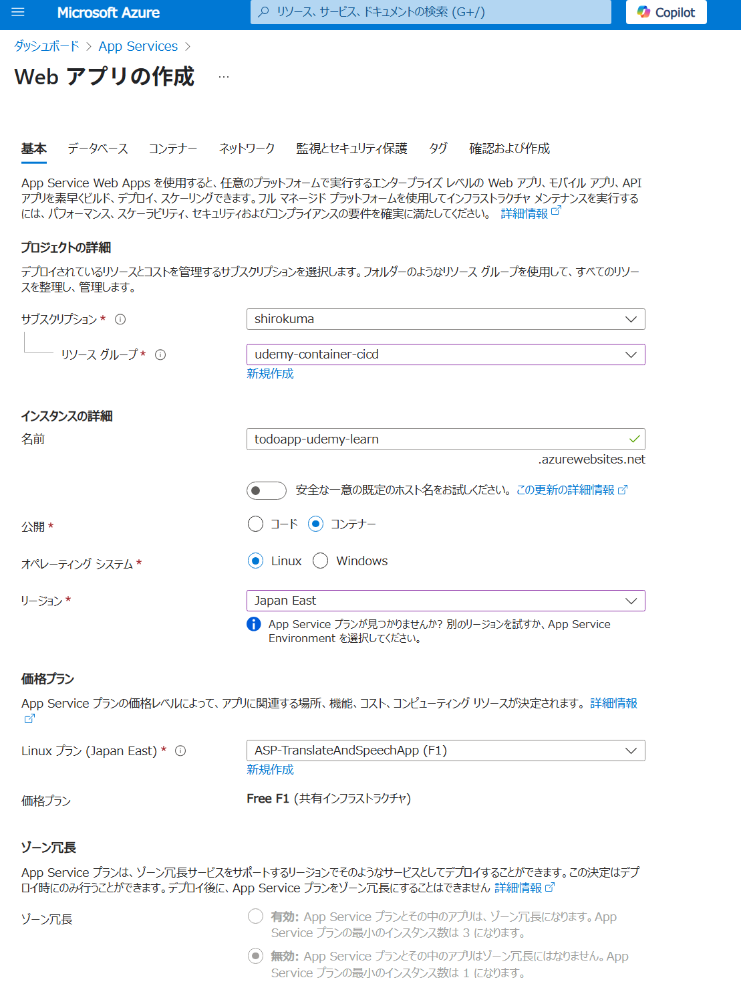

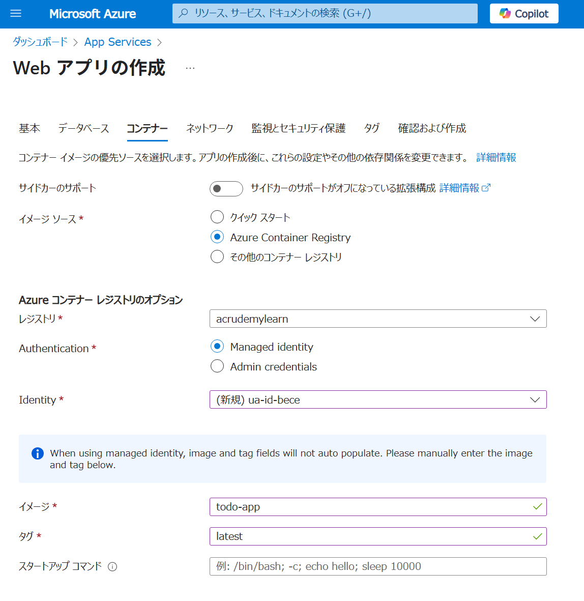

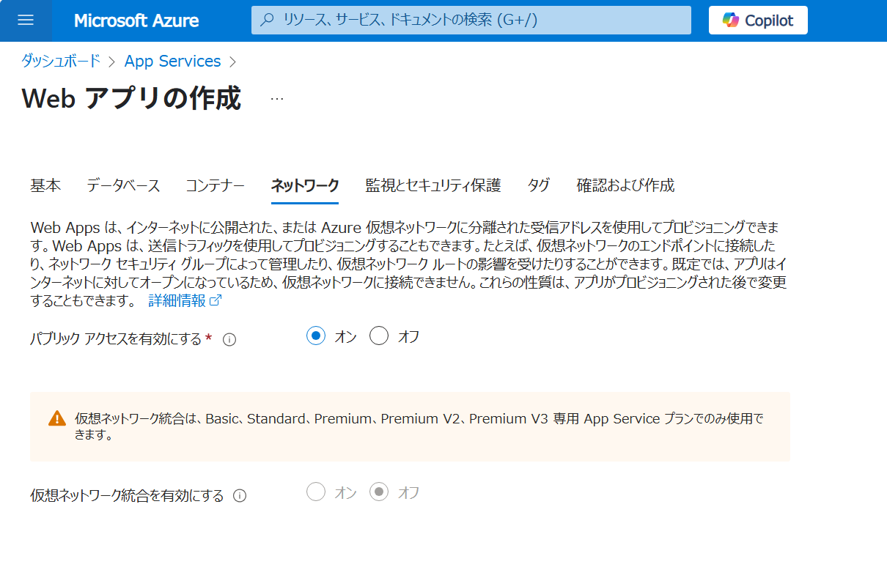

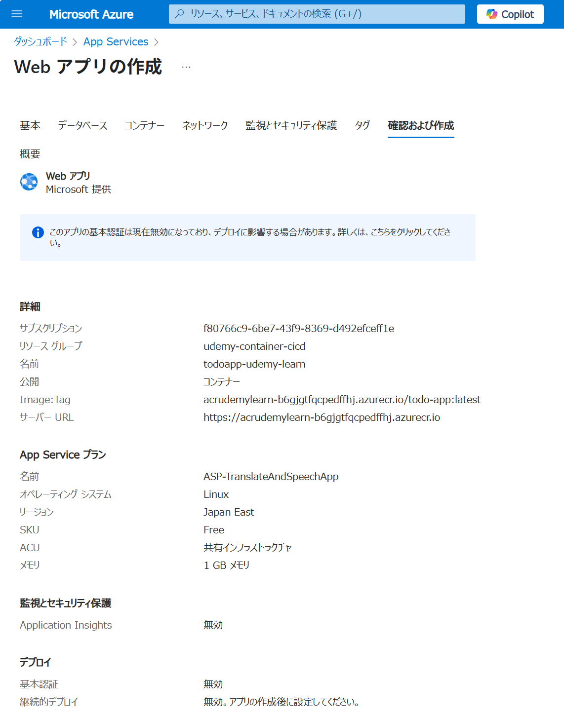

継続的デプロイをONにすると、ACRにPushした際に自動でデプロイされるようになります。
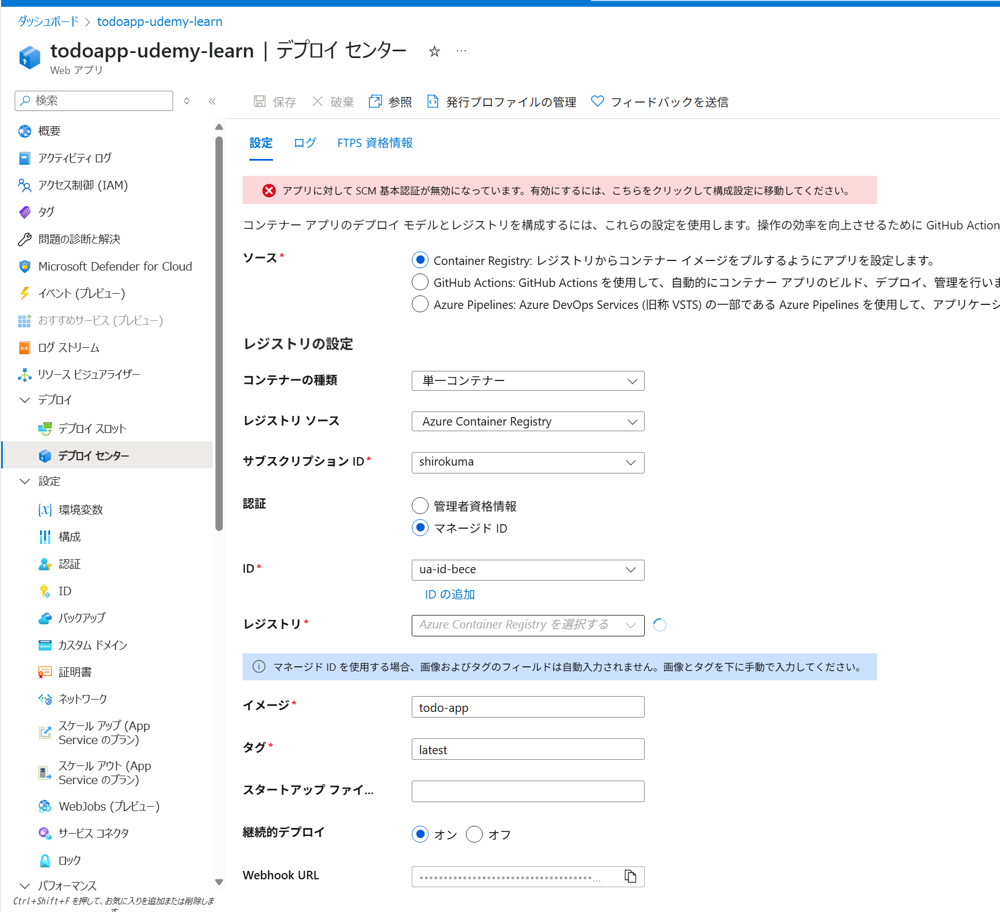

CORS設定
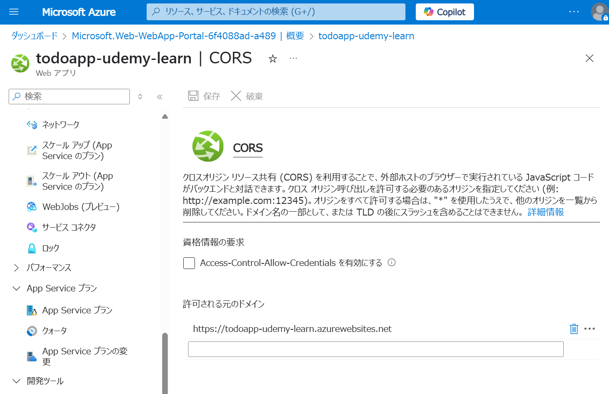

環境変数設定
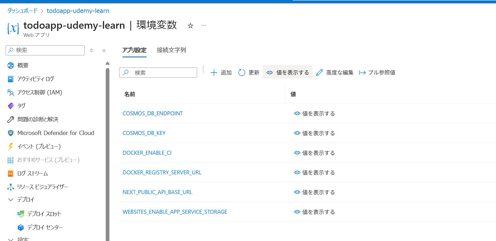

# GitHubActionsでのCI/CD
https://learn.microsoft.com/ja-jp/azure/app-service/deploy-container-github-action?tabs=publish-profile&pivots=github-actions-containers-linux

SCM基本認証をONに
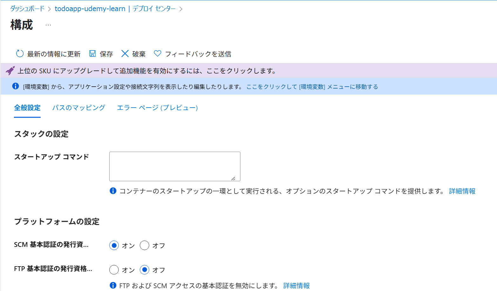

プロファイルのDownload
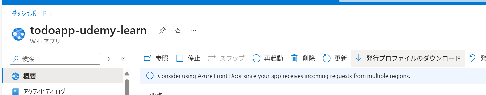

## GitHubにシークレット登録

### 認証用プロファイル

GitHub側でリポジトリシークレットを作成
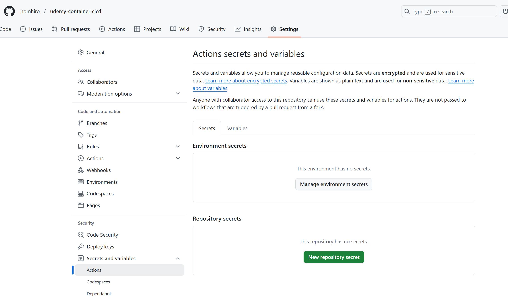

Name：AZURE_WEBAPP_PUBLISH_PROFILE
Secret：ダウンロードしたプロファイルの内容をそのままペースト
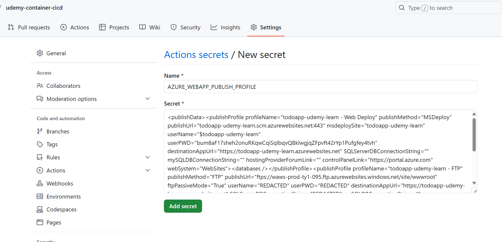

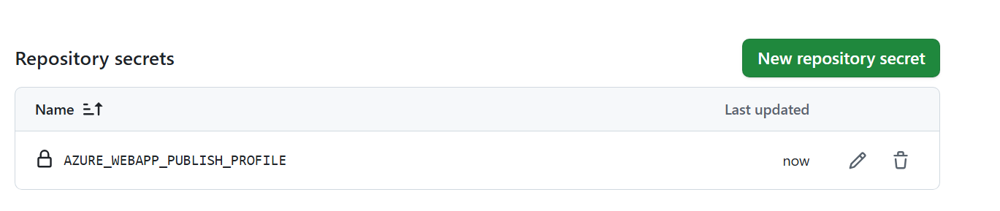

### コンテナレジストリ用

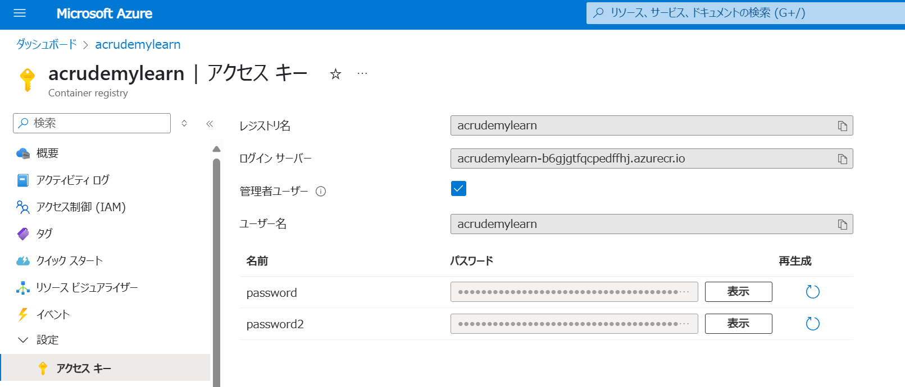

Name：REGISTRY_USERNAME
Secret：acrudemylearn

Name：REGISTRY_PASSWORD
Secret：パスワード

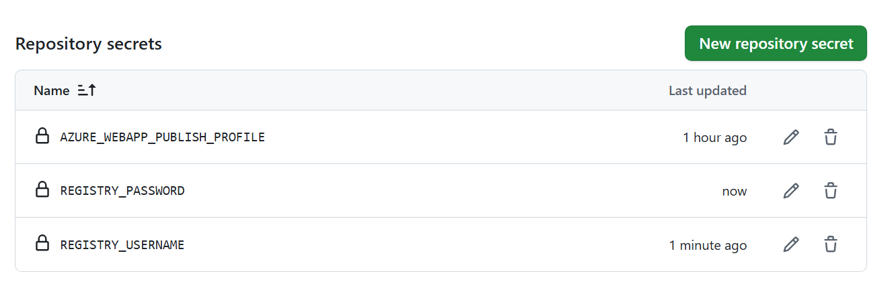

### アプリで使う環境変数
COSMOS_DB_ENDPOINT と COSMOS_DB_KEY を登録
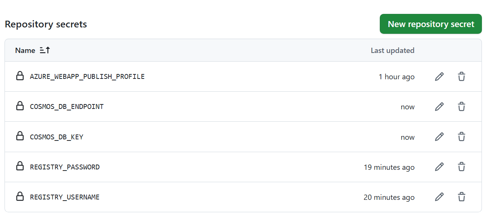

## yamlファイルの作成
```yaml
name: ToDo App Workflow

on: [push]

jobs:
  build:
    runs-on: ubuntu-latest

    steps:
    - uses: actions/checkout@v2
    - uses: azure/docker-login@v1
      with:
        login-server: acrudemylearn-b6gjgtfqcpedffhj.azurecr.io
        username: ${{ secrets.REGISTRY_USERNAME }}
        password: ${{ secrets.REGISTRY_PASSWORD }}
    - run: |
        docker build . -t acrudemylearn-b6gjgtfqcpedffhj.azurecr.io/todoapp:${{ github.sha }}
        docker push acrudemylearn-b6gjgtfqcpedffhj.azurecr.io/todoapp:${{ github.sha }}