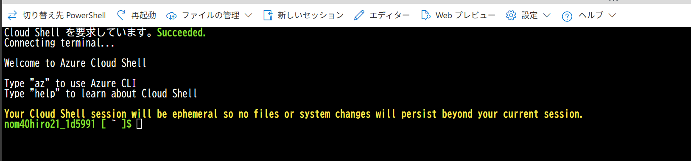
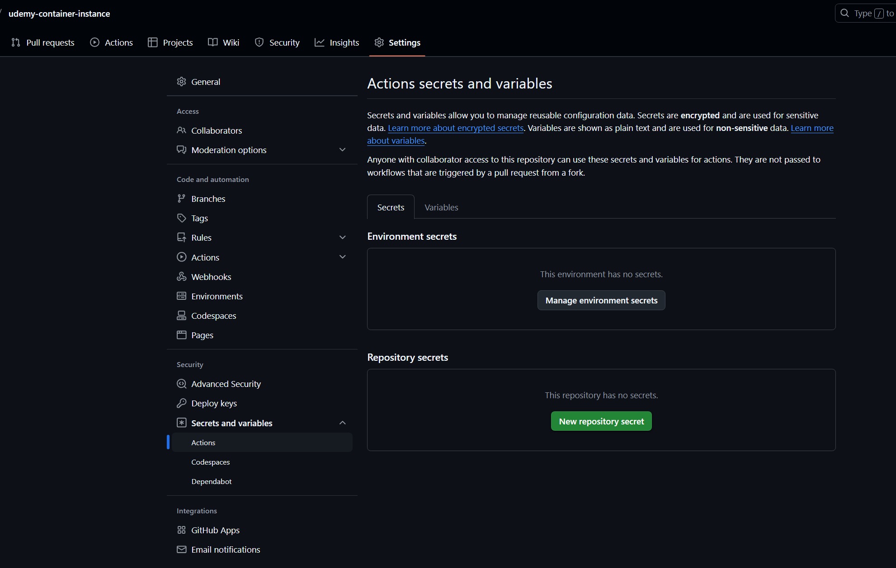

事前のリソース作成は不要。最初からContainer Instance をGitHubActionsで自動デプロイする


https://learn.microsoft.com/ja-jp/azure/container-instances/container-instances-github-action

## GitHubActionsで各リソースを操作するための認証情報

CloudShellを開く


Azure CLIでAzureにログイン
```bash
az login
```

リソースグループのリソースIDを取得
```bash
groupId=$(az group show --name udemy-container-cicd --query id --output tsv)
echo $groupId
```

サービスプリンシパルを作成
出力されるJSONを保存しておく。ClientIDも控えておく。
```bash
az ad sp create-for-rbac --scope $groupId --role Contributor --sdk-auth
```

表示されるJsonを控えておく
```bash
{
  "clientId": "xxxx6ddc-xxxx-xxxx-xxx-ef78a99dxxxx",
  "clientSecret": "xxxx79dc-xxxx-xxxx-xxxx-aaaaaec5xxxx",
  "subscriptionId": "aaaa0a0a-bb1b-cc2c-dd3d-eeeeee4e4e4e",
  "tenantId": "aaaabbbb-0000-cccc-1111-dddd2222eeee",
  "activeDirectoryEndpointUrl": "https://login.microsoftonline.com",
  "resourceManagerEndpointUrl": "https://management.azure.com/",
  "activeDirectoryGraphResourceId": "https://graph.windows.net/",
  "sqlManagementEndpointUrl": "https://management.core.windows.net:8443/",
  "galleryEndpointUrl": "https://gallery.azure.com/",
  "managementEndpointUrl": "https://management.core.windows.net/"
}
```


Azure サービス プリンシパルの資格情報を更新して、コンテナー レジストリに対するプッシュとプルのアクセスを許可
```bash
registryId=$(az acr show --name acrudemylearn --resource-group udemy-container-cicd --query id --output tsv)
echo $registryId
```

レジストリに対するプッシュおよびプル アクセスを付与する AcrPush ロールを割り当てる
```bash
az role assignment create --assignee b0dee88a-3bb1-4cc2-bfc7-ed03cfc65ced --scope $registryId --role AcrPush
```

## 資格情報を GitHub リポジトリに保存
- AZURE_CREDENTIALS
- REGISTRY_LOGIN_SERVER
- REGISTRY_USERNAME
- REGISTRY_PASSWORD
- RESOURCE_GROUP

