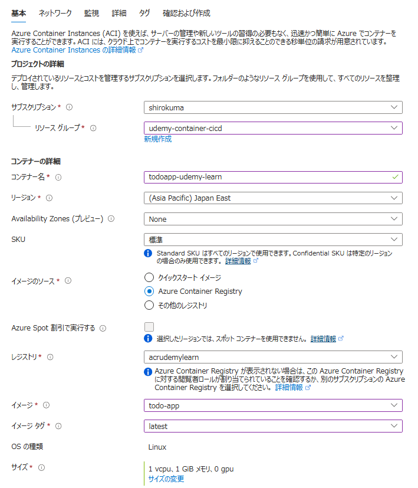

# Container Instance リソース作成

todoapp-udemy-learn

「安全としてマーク」(Mark as secure) の設定は、環境変数の値を機密情報として扱うためのオプションです。これを有効にすると、環境変数の値が非表示になり、Azure ポータルやログなどで直接確認できなくなります。これにより、パスワードや API キーなどの機密情報を保護することができます。
Azure Container Instances では、環境変数を設定する際にこのオプションを利用することで、セキュリティを強化できます。例えば、データベースの接続情報や認証トークンなどを「安全としてマーク」することで、外部からの不正アクセスを防ぐことが可能です。

