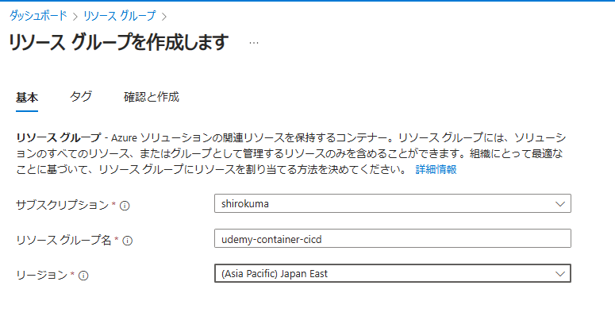
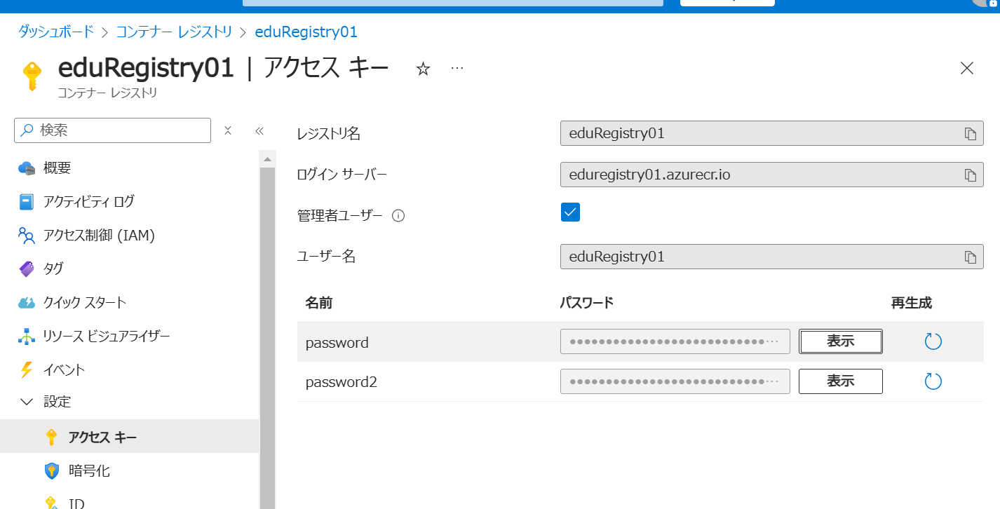
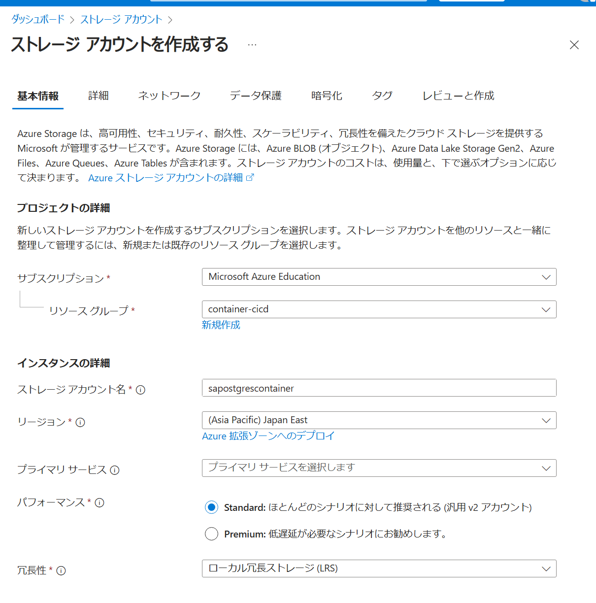
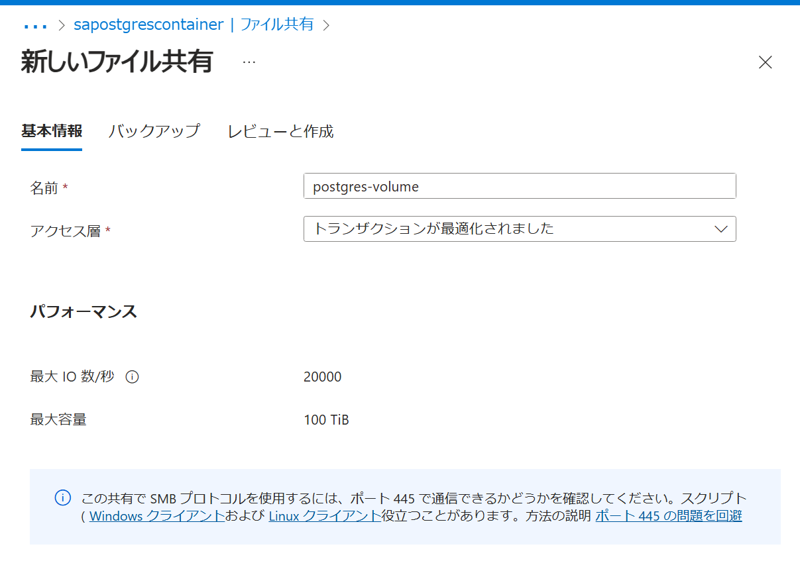
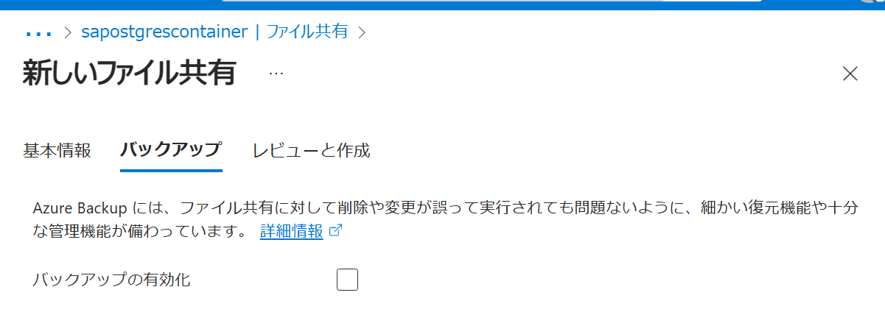

## Azureリソース

### Resource Group

udemy-container-cicd




### Azure Container Registry
https://learn.microsoft.com/ja-jp/azure/container-instances/container-instances-tutorial-prepare-acr

前提
- Azure CLIがインストールされていること


UdemyContainerCICDLearn

Azure CLIでログイン
```bash
az login
```

コンテナーレジストリにサインイン
```bash
az acr login --name eduRegistry01
```

コンテナーレジストリにサインイン
```bash
PS C:\Users\AdmUser\Documents\Udemy\udemy-container-cicd> az acr login --name eduRegistry01
Unable to get AAD authorization tokens with message: Please run 'az login' to setup account.
Unable to get admin user credentials with message: Please run 'az login' to setup account.
Username: eduRegistry01
Password:
Login Succeeded
```



コンテナー イメージのタグ付け
まずはコンテナーレジストリのログインサーバのフルネームを取得
```bash
az acr show --name eduRegistry01 --query loginServer --output table
```
```bash
Result
------------------------
eduregistry01.azurecr.io
```

ローカルのコンテナーイメージを確認
```bash
docker images
```

コンテナー イメージのタグ付け
```bash
docker tag postgres:15 eduregistry01.azurecr.io/postgres:v1
docker tag node:22 eduregistry01.azurecr.io/node:v1
```

コンテナー イメージのプッシュ
```bash
docker push eduregistry01.azurecr.io/postgres:v1
docker push eduregistry01.azurecr.io/todo-app:v1
```

コンテナーレジストリのイメージ一覧
```bash
az acr repository list --name eduRegistry01 --output table
```

### Postgres用のStorage Account
sapostgrescontainer



postgres-volume




