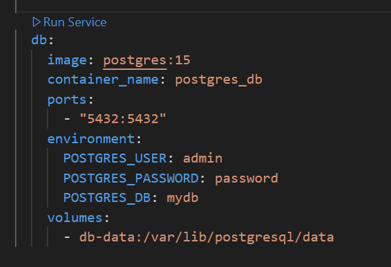

# ローカル開発環境
前提
- Visual Studio Codeがインストールされていること
- Dockerがインストールされていること

## Postgres

PostgresのDockerを起動


PostgreSQLコンテナにアクセスする
```bash
docker exec -it postgres_db bash
```

コンテナ内でpsqlコマンドを使用してデータベースに接続
```bash
psql -U admin -d mydb
```

テーブル作成のSQLスクリプトを実行
```sql
CREATE TABLE todos (
  id SERIAL PRIMARY KEY,
  title VARCHAR(255) NOT NULL,
  completed BOOLEAN NOT NULL DEFAULT FALSE,
  status VARCHAR(50) NOT NULL DEFAULT 'not started'  -- 追加
);
```

#### 参考

テーブル削除
```sql
DROP TABLE IF EXISTS todos;
```

## Webアプリ
todo-appディレクトリに移動
```bash
cd todo-app
```

モジュールのインストール
```bash
npm install
```

アプリケーションの起動
```bash
npm run dev
```